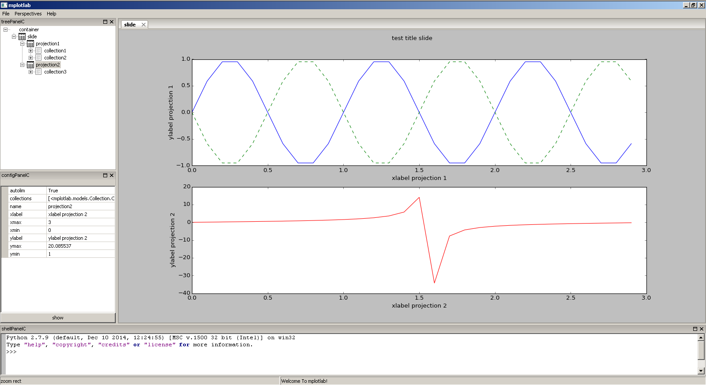
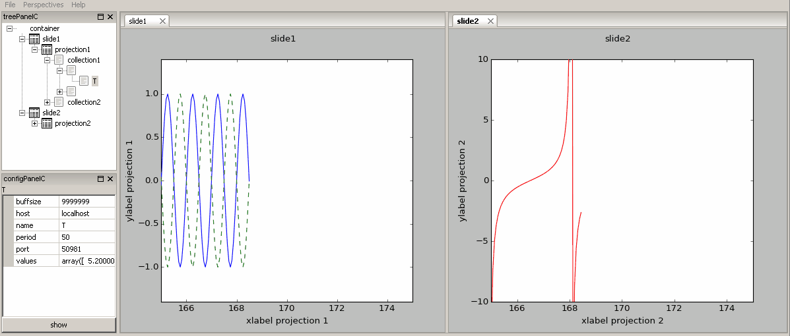

========
Examples
========

Static slide
------------

.. literalinclude:: ../Examples/Sandbox.py

The slide can be saved or loaded at user disposal. 
It is saved in an .xml format.

.. literalinclude:: ../Examples/slide_static.xml
   :language: xml

Dynamic slide
-------------

TCP/IP Server (to run first)

.. literalinclude:: ../Examples/Sandbox2_server.py

Slides that contain a dynamic socket source that listens to the server (to run after)

.. literalinclude:: ../Examples/Sandbox2.py

Several slides can be saved or loaded at user disposal. 
For dynamic source like the socket source, only its configuration is saved.

.. literalinclude:: ../Examples/slides_dynamic.xml
   :language: xml